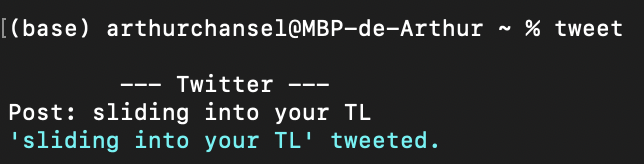

# tweet

## Twitter keys and access tokens
To use tweet you'll need your Twitter account keys and access tokens. Complete the file "mykeys.py" with your personnal account informations (don't share them with anyone).

## Launch the program
Launch the program with python by typing "python tweet.py" in the program directory.

## How does it work ?
As you launch the program, you'll see the following interface in the Terminal command line. Enter some text after "Post:" then hit enter, and a blue message will confirm that you successfully tweeted !

  

## Libraries
This program uses tweepy package.

## License
[MIT License](LICENSE)
